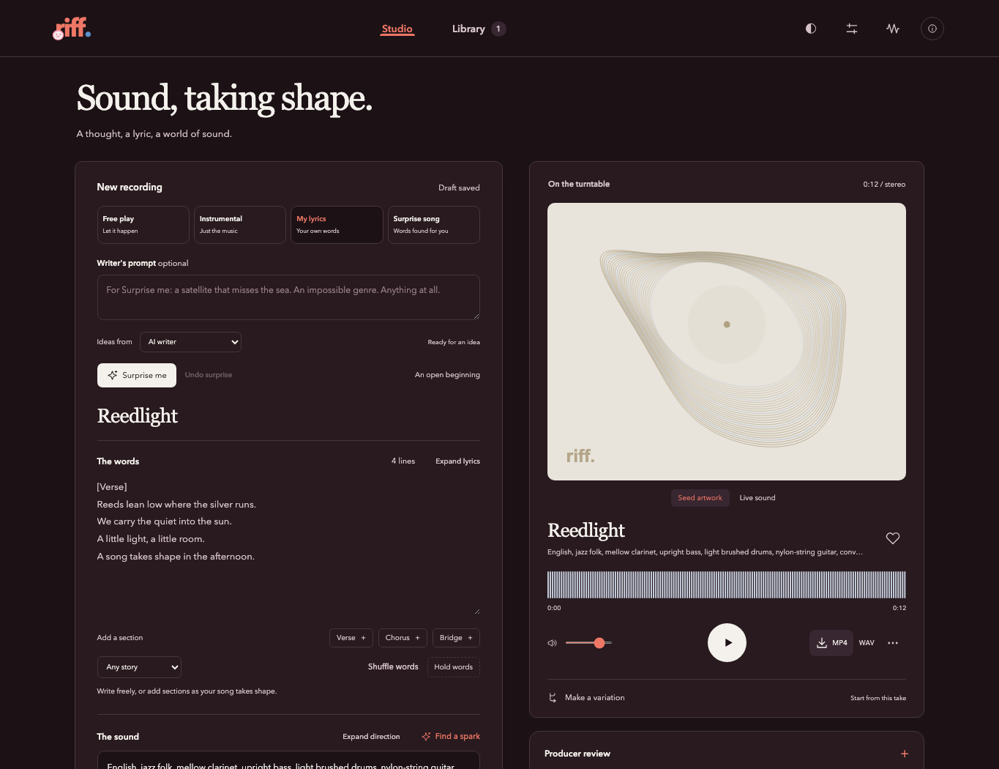
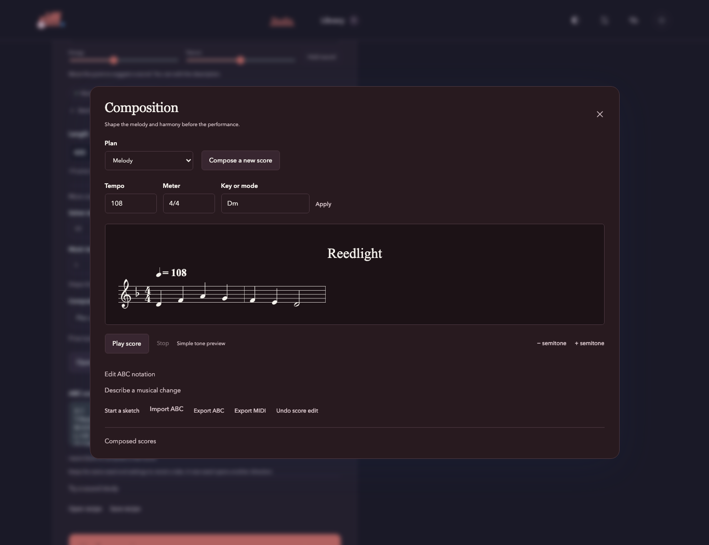

# Riff

A generative music studio by **Flip Engineering**, powered by YuE2 and audio.cpp.
Start with a feeling, a lyric sheet, a score, or an empty page. Make short studies,
shape the composition, and collect the takes you want to keep.



## Install

Riff runs on Apple Silicon with Metal, or Linux with NVIDIA CUDA or CPU.
Python 3.9 or newer is required. Download and run the installer:

```sh
curl -fL https://github.com/Flip-Engineering/riff/releases/latest/download/install.py -o riff-install.py
python3 riff-install.py
```

The installer verifies the release archive and opens the studio. In **Studio
settings**, choose an accelerator and **Download and set up**. Setup builds the
pinned audio.cpp engine and downloads about 2.93 GB of Q4 music weights, the F16
audio decoder, and tokenizer files. Missing prerequisites are shown in the app.

On macOS, install Apple's command-line tools with `xcode-select --install`.
On Ubuntu, install `python3-venv`, `git`, and `build-essential`; NVIDIA acceleration
also needs a compatible driver and CUDA Toolkit with `nvcc` on PATH. FFmpeg is
needed for optional audio reviews and MP4 exports. See [installation and updates](docs/install.md).

**Model terms:** Riff's application code is MIT licensed. The separately downloaded
[YuE2 weights use CC BY-NC 4.0](https://huggingface.co/m-a-p/YuE2-3B).
The application license does not change the model's terms.

## Make, listen, refine

- **An open starting point.** Free play, instrumental direction, supplied lyrics,
  or an original surprise song. Hold the words or sound while exploring the other.
  Write with optional local AI, OpenRouter, or instant phrase suggestions.
  AI writers work with the complete generation recipe: words, sound, score,
  planning, sampling and acoustic controls. Variations include the source score
  and listening notes; the result fills editable controls with a complete Undo.
- **Composition.** Generate YuE2's symbolic plan before rendering music. Edit its
  melody and harmony in a score workspace, change tempo/meter/key, transpose, edit
  notes, audition tones, and import/export ABC or MIDI. Describe a musical change
  to an optional OpenRouter composer and preview its proposed score.
- **Short studies.** Select a few lyric lines and try a brief take while retaining
  the full draft. Duration and quality shortcuts stay editable.
- **Compare takes.** Switch A/B at the same listening position, loop a passage,
  and see which musical inputs changed. Reorder waiting takes with keyboard controls.
- **Shape a performance.** Save its phrasing and score before rendering audio,
  or return to a completed stage after an interruption. Explore acoustic variations
  from the same performance, with an editable draft and undo.
- **Granular control.** Melody/chord planning, supplied ABC, guidance, seeds,
  semantic and planning sampling, repetition controls, acoustic solver steps,
  and a multistep synthesis method that reuses earlier velocity estimates.
  Blank optional controls retain the runtime defaults.
- **Listening and library.** Playback, seeking, a measured waveform, sculptural seed
  artwork with an immersive sound view, favorites, notes, search, reversible archiving,
  and animated MP4, WAV, and PNG artwork exports. Share a complete song or a marked
  passage with its living artwork, with 4K/60 fps export and editable framing. Adjust
  surface, movement, color and texture in the sound view. Restore
  any recording's recipe and make a variation.
- **Producer review.** Optional direct audio review through OpenRouter, informed
  by the recording's recipe and actual YuE2 score. Each review returns a complete
  recommended take: lyrics, direction, score, duration, seed, and sampling settings.
  Generate it directly, edit it in the studio, or export the recipe. The default model is
  `google/gemini-3.8-flash`; the studio never silently substitutes a model.
- **Saved sounds.** Browse, create, edit, and remove reusable sound prompts.
  [Adapter research](docs/adapters.md) distinguishes these from learned LoRAs.



Lyrics, structure, and musical direction are optional. A score guides generation;
its notes and timings are not a promise of exact audio reproduction. Instrumental
requests can still produce vocal textures. [Model capabilities](docs/capabilities.md)
describes the controls and current runtime boundaries.

## Connections and storage

Open **Review settings** to save an OpenRouter key and select a model. Keys use
macOS Keychain or Linux Secret Service (`secret-tool`); there is no plaintext key
fallback. Requests send only the material described beside the action. Provider
usage charges apply. Audio review directly assesses music; no ASR pipeline runs.

Installed releases keep the library, models and recordings in a persistent
workspace outside versioned app files. Updates are verified and staged before
activation. Automatic checks are enabled; preparing updates while idle is opt-in.
Source checkouts remain under Git control. Back up the workspace's `data/` and
`outputs/` together; credentials are managed separately by the OS.

## Run from source

```sh
git clone https://github.com/Flip-Engineering/riff.git
cd riff
python3 studio.py
```

Core studio operation uses Python's standard library and static web assets; it
needs no frontend build or npm installation. Start setup from the app, or run:

```sh
python3 setup_engine.py --backend metal  # or cuda / cpu
python3 run.py --free --steps 8 --max-seconds 28
```

The optional Apple Silicon writer is installed with `./setup-writer.sh` using
`uv`. OpenRouter writing and phrase suggestions work on both supported platforms.

Q4 weights, memory mapping, direct cache writes and explicit graph lifetimes
reduce native inference memory. Earlier 12–30 second M4 previews measured around
2.7 GiB of process footprint. A 201.5-second saved-performance render measured
3.39 GB after the synthesis cache rewrite, down from 6.59 GB with identical audio.
Fresh generation also includes semantic sampling and needs more memory; its full
input baseline measured 10.41 GB. The engine exits after each take.
[Validation](docs/validation.md) records the settings and separates inference
measurements from build and browser checks.

See [contributing](CONTRIBUTING.md), [design](DESIGN.md), and
[third-party notices](NOTICE.md).
